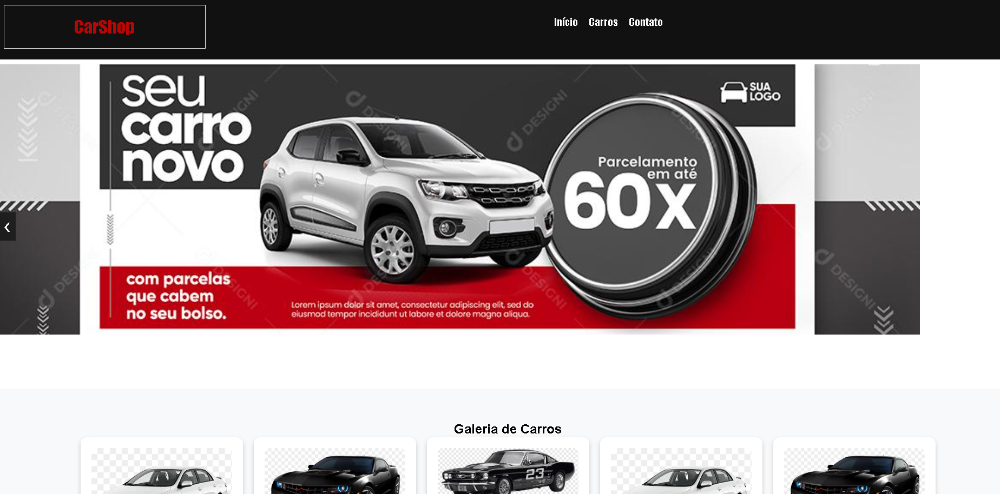

# 🚗 Loja de Veículos

Uma plataforma moderna e responsiva para compra e venda de veículos, com um design atraente e funcionalidades interativas.



## 🌟 Funcionalidades

✅ **Página Inicial** com banner em **slide automático**  
✅ **Galeria de Veículos** com **cards** exibindo imagem, nome e preço  
✅ **Página de Detalhes do Veículo** com informações completas  
✅ **Galeria Interativa** com imagens clicáveis  
✅ **Modal** para exibição ampliada das fotos do veículo  
✅ **Formulário de Contato** para interessados  

## 🛠️ Tecnologias Utilizadas

- **HTML5** → Estrutura da página  
- **CSS3** → Estilização responsiva e moderna  
- **JavaScript (Vanilla JS)** → Funcionalidades interativas  

## 📂 Como Rodar o Projeto

1️⃣ **Clone este repositório**  
```bash
git clone https://github.com/wanderleypatricio/carshop-html-css-javascript.git
